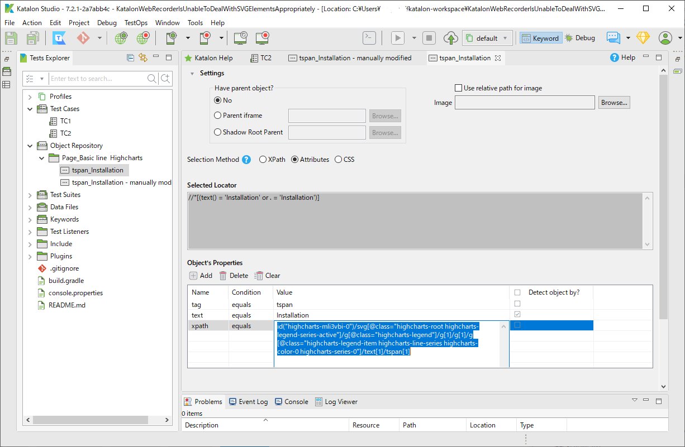

Katalon Web Recorder is unable to deal with SVG Elements appropriately
================================================

This is a small Katalon Studio project for demostration purpose.
You can clone this out to your PC, open it with your Katalon Studio.

# Problem to solve

In the Katalon Forum, there was a post https://forum.katalon.com/t/katalon-css-xpath-not-working-with-svg-charts/9155/36

>I saw in the release notes for v7.1 that the Web Recorder was updated to generate XPath locator for SVG elements. I’ve have a highcharts graph that I’ve been hoping to capture for some time. However, after upgrading to version 7.2.1, I am still having the same issue. Using the Web Spy, I can see can capture the element, however, if I then ask it to highlight the element it just captured, it says the element cannot be found.

In my opinion, **Katalon Studio is NOT capable of generating appropriate XPath locators for SVG elements at all**. I will describe my view here.

I used Katalon Studio verion 7.2.1 to test.

# See the demo

I used the following URL as my Application Under Test:

- https://www.highcharts.com/demo/line-basic

This is a demo page of the "highcharts" JavaScript library which generates SVG elements.

## "Test cases/TC1"

I used "Web Recorder" to generate a Test Object `Object Repository/Page_Basic line Highcharts/tspan_Installation`. That Test Object has the following properties:


When I tried for the first time the test object had a locator as follows:

```
//*[(text() = 'Installation' or . = 'Installation')]
```

When I ran the TC1, it failed.
I changed the test object a bit so that it had a locator as follows:

```
id("highcharts-mli3vbi-0")
  /svg[@class="highcharts-root highcharts-legend-series-active"]
    /g[@class="highcharts-legend"]
      /g[1]
        /g[1]
          /g[@class="highcharts-legend-item highcharts-line-series highcharts-color-0 highcharts-series-0"]
            /text[1]
              /tspan[1][count(. | //*[(text() = 'Installation' or . = 'Installation')]) = count(//*[(text() = 'Installation' or . = 'Installation')])]
```

When I ran the TC1 once more, it failed again. Both selectors failed to find a SVG `<tspan>Installation</tspan>`.

This experiments revealed that the locators generated by Katalon Web Recorder is not appropriate at all.

## "Test Cases/TC2"

I made another script "Test Cases/TC2". I made another test object **manually**. `Object Repository/Page_Basic line Highcharts/tspan_Installation - manually modified`, which has the following XPath expression:

```
//div[starts-with(@id,"highcharts-")]
  /*[local-name()="svg" and contains(@class,"highcharts-root")]
    /*[local-name()="g" and contains(@class,"highcharts-legend")]
      /*[local-name()="g"][1]
        /*[local-name()="g"][1]
          /*[local-name()="g" and contains(@class,"highcharts-legend-item")][1]
            /*[local-name()="text"][1]
              /*[local-name()="tspan"][1]
```

When I ran the TC2, it passed. It can locate the SVG `<tspan>Installation<tspan>` node.

# Discussion

"Test Cases/TC1" failed. This tells you Katalon Studio's Web Recorder tool is not capable of dealing with SVG elements appropriately. I haven't checked the Web Spy tool, but I presume it would not be cleverer than Web Recorder.

The XPath expression that I wrote manually for "Test Cases/TC2" can deal with SVG elements appropriately.

In fact, there is a big semantic gap between the 2 XPath instances.

Will the Web Recorder and the Web Spy be sometime in future improved so that they generates XPath expression which deals with SVG Elements appropriately perfectly out of box? Honestly, I do not expect it to happen. It would be super difficult. If you wait for some improvement, I suppose, it will be waste of time.

I would recommend to those who need to test SVG in Web pages using Katalon Studio

1. You should not expect Web Recorder and Spy tools to automatically generate locators to point SVG elements at 100% accuracy.
2. Rather you should train yourself for the W3C XPath technology and the W3C XML Namespace specification so that you can understand the difference between the 2 XPath expressions presented above. You need to train your self so that you can write appropriate XPath for yourself manually.
3. For getting started with XPath, see https://www.guru99.com/xpath-selenium.html
4. For getting started with XML Namespace, see https://www.w3schools.com/xml/xml_namespaces.asp
